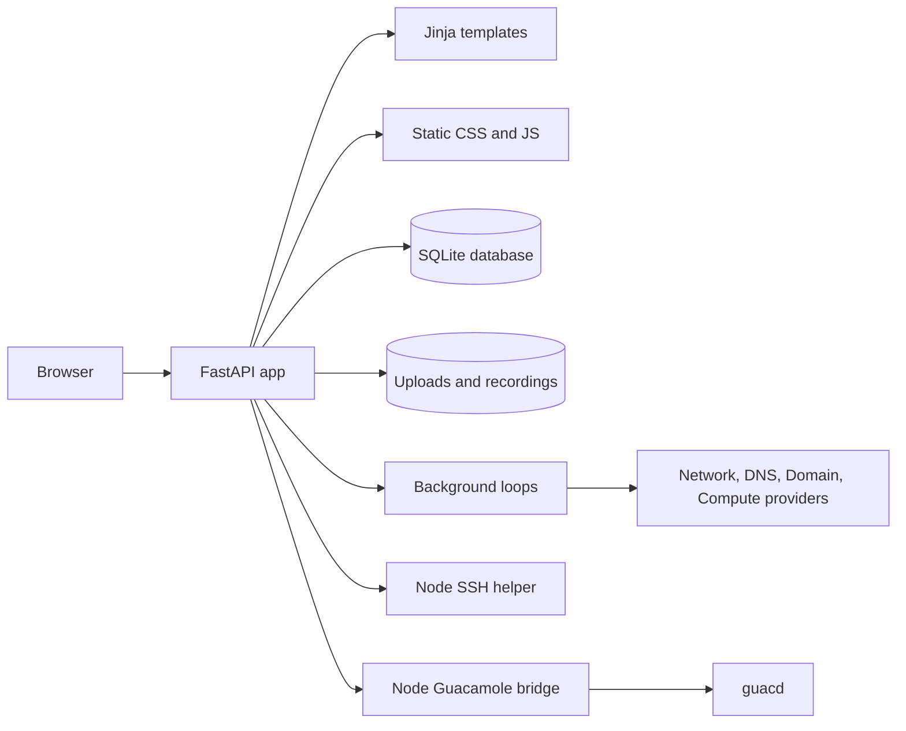
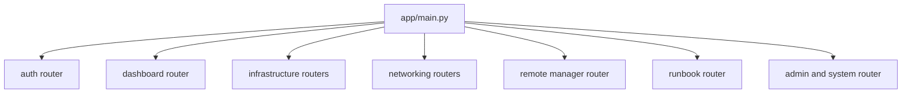

---
title: "Architecture"
description: "Understand the current Kaya application architecture."
order: 1
version: "current"
---

Kaya is a FastAPI application using server-rendered Jinja templates, SQLAlchemy models, SQLite by default, and local JavaScript/CSS assets.

This page documents the current Kaya application architecture. It describes how Kaya works today rather than a future target architecture.

## Overall architecture

The FastAPI process owns routing, authentication, server-rendered pages, settings, database access, background polling, audit logging and integration coordination.

## Repository structure

| Path | Purpose |
| --- | --- |
| `app/main.py` | FastAPI app setup, middleware, router registration, startup/shutdown and database bootstrap |
| `app/models/models.py` | SQLAlchemy model definitions |
| `app/db/session.py` | Database engine and session factory |
| `app/core/` | Configuration, security, CSRF, demo mode, branding and TOTP helpers |
| `app/routers/` | Feature routers and route handlers |
| `app/services/` | Shared business logic, polling, integrations and helpers |
| `app/templates/` | Jinja templates |
| `app/static/` | CSS, JavaScript, brand assets and vendored browser assets |
| `scripts/` | Migration, demo seed and Node helper scripts |
| `tests/` | Current automated tests |

## FastAPI structure

`app/main.py` creates the FastAPI application, mounts static files, configures middleware, registers routers and starts background services.

Important startup work:

- Create required data/upload/recording directories.
- Create SQLAlchemy tables.
- Run manual migration helpers.
- Ensure default VLAN data exists.
- Start background loops unless demo mode is enabled.
- Start the Kaya remote helper service.

Important shutdown work:

- Cancel background tasks.
- Stop Kaya remote helper services.
- Stop the Guacamole bridge.

## Routing

Routes are grouped by router modules in `app/routers/` and registered centrally in `app/main.py`.

The application uses dependency functions such as `require_user`, `require_editor` and `require_admin` for route-level permission checks.

## Templates

Kaya uses server-rendered Jinja templates from `app/templates`.

`base.html` provides the main layout, header, account menu, theme toggle, sidebar navigation and shared CSS/JavaScript imports.

## Static assets

Static files are mounted from `app/static`. Main CSS files are `app.css`, `imports.css`, `demo.css` and `kaya.css`.

Shared JavaScript includes sidebar state, table sorting/filtering/column visibility, inline editing and settings tabs. Module-specific JavaScript lives in `app/static/js`.

## Services

Service modules in `app/services/` hold cross-router logic such as audit logging, session tracking, site settings, managed lists, custom fields, import/export, mail delivery, network monitoring, domain lookup, DNS providers, compute monitoring, remote helper process management and Guacamole bridge management.

## Database layer

Kaya uses SQLAlchemy ORM models and a session dependency. SQLite is the default database engine.

Tables are created from metadata and evolved through manual migration code. See [Database](/docs/developer/database) for schema and migration details.

## Configuration loading

Environment settings are defined in `app/core/config.py`.

Database-backed settings are stored primarily in `remote_manager_settings`. This includes site settings, remote settings, backup settings, SMTP settings, DNS settings and security settings.

Docker startup can generate persistent runtime secrets into `/app/data/.runtime.env`.

## Docker architecture

The Docker deployment runs:

- `kaya`: FastAPI, Python, Node helper scripts and static files
- `guacd`: Apache Guacamole daemon for RDP sessions

Persistent bind mounts:

- `./data:/app/data`
- `./uploads:/app/uploads`
- `./data/remote-recordings:/app/data/remote-recordings`

The Kaya container is configured as read-only with writable volumes and tmpfs.
