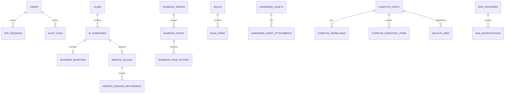

---
title: "Database"
description: "Current Kaya database engine, schema and migration model."
order: 3
version: "current"
---

Kaya uses SQLAlchemy models with SQLite as the default database engine.

## Database engine

Default location:

- Docker: `/app/data/kaya.db`
- Docker Compose bind mount: `./data/kaya.db`

The configured database URL defaults to:

```text
sqlite:////app/data/kaya.db
```

## Schema overview

Major tables:

- `users`
- `password_reset_tokens`
- `app_sessions`
- `licences`
- `vlans`
- `ip_addresses`
- `network_monitors`
- `network_monitor_checks`
- `remote_access`
- `remote_manager_settings`
- `remote_session_recordings`
- `domain_records`
- `domain_record_history`
- `dns_providers`
- `dns_investigations`
- `hardware_assets`
- `hardware_asset_attachments`
- `racks`
- `rack_items`
- `custom_fields`
- `custom_field_values`
- `managed_list_items`
- `runbook_spaces`
- `runbook_pages`
- `runbook_page_history`
- `compute_hosts`
- `compute_workloads`
- `compute_inventory_items`
- `compute_metrics`
- `compute_events`
- `backup_records`
- `backup_jobs`
- `audit_logs`

## Relationships



## Migration process

Tables are created with `Base.metadata.create_all()` and evolved through manual SQLite migration logic in:

- `app/main.py`
- `scripts/migrate_sqlite.py`

There is no Alembic migration system.

Current migration risks:

- Runtime and script migrations can drift.
- Most migrations are additive.
- SQLite-specific assumptions are present.
- Model definitions and manual DDL must be kept in sync.

## Seed and default data

Bootstrap ensures a default VLAN named `VLAN 1`.

The first real admin is created through `/setup`.

Demo mode seeds synthetic users, VLANs, IPs, monitors, remotes, DNS provider data, hardware assets, licences, domains, runbooks, compute hosts/workloads, backup records/jobs, managed lists and audit rows.

## Data ownership

Kaya uses a mixture of explicit foreign keys and polymorphic references.

Explicit ownership exists for many records through foreign keys such as user IDs, host IDs and module-specific parent IDs.

Custom fields use `entity_type` and `entity_id`, so database-level referential integrity is not enforced for those values.
