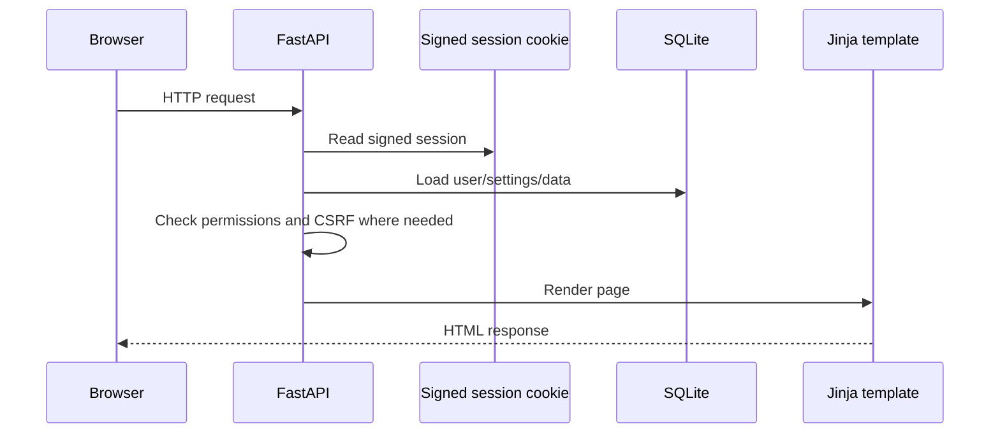

---
title: "Functional Specification"
description: "Index of how Kaya currently works internally."
order: 2
version: "current"
---

This functional specification explains how Kaya currently works. It is an index into focused documentation pages rather than one large document.

## Application overview

Kaya is a self-hosted infrastructure management application for homelabs, small IT environments and technical administrators.

It combines:

- Inventory tracking
- Remote access
- Runbooks
- Licence management
- IP/VLAN tracking
- DNS visibility
- Domain tracking
- Network monitoring
- Compute host monitoring
- Backup coordination
- Audit logging
- Site administration

## Core concepts

- Users and roles
- Infrastructure records
- Operational modules
- Documentation/runbooks
- Settings
- Auditability
- Demo mode

See [Overview](/docs/developer/overview) and [Architecture](/docs/developer/architecture).

## High level architecture

Kaya is a FastAPI/Jinja/SQLAlchemy application with local static assets, SQLite by default, Docker Compose deployment and Node helper services for remote access.

See [Architecture](/docs/developer/architecture).

## Request flow

## Authentication, authorisation and sessions

See [Security](/docs/developer/security).

## Database overview

See [Database](/docs/developer/database).

## Configuration

Configuration comes from environment variables, generated runtime secrets and database-backed settings.

See [Architecture](/docs/developer/architecture) and [Site Administration](/docs/developer/modules/site-administration).

## Services and background tasks

Shared service modules handle audit logging, settings, custom fields, managed lists, email, import/export, provider integrations and background polling.

Background tasks include:

- Network monitor loop
- Domain polling loop
- Compute monitor loop
- Remote helper process management
- Guacamole bridge management

## Module architecture

Each user-facing area has a module page:

- [Dashboard](/docs/developer/modules/dashboard)
- [Runbook Manager](/docs/developer/modules/runbook-manager)
- [Remote Manager](/docs/developer/modules/remote-manager)
- [Networking](/docs/developer/modules/networking)
- [DNS Manager](/docs/developer/modules/dns-manager)
- [Docker / Compute Manager](/docs/developer/modules/docker-manager)
- [Backup Manager](/docs/developer/modules/backup-manager)
- [Asset and Rack Management](/docs/developer/modules/asset-and-rack-management)
- [Licence Manager](/docs/developer/modules/licence-manager)
- [Site Administration](/docs/developer/modules/site-administration)
- [Data Management](/docs/developer/modules/data-management)

## External integrations

See [API & Integrations](/docs/developer/api).

## Deployment

See [Deployment](/docs/developer/deployment).

## Security model

See [Security](/docs/developer/security).

## Current limitations and technical debt

Current known limitations include:

- SQLite-first design.
- No formal Alembic migration system.
- Limited automated tests.
- Import/export only supports licences and IP addresses.
- RBAC is coarse-grained.
- No object-level permissions.
- Background workers run inside the web process.
- No queue system for backup jobs beyond database state.
- No antivirus/content scanning for uploads.
- No full REST API for most modules.
- Manual migration logic is duplicated across runtime startup and `scripts/migrate_sqlite.py`.
- `RemoteManagerSetting` stores many unrelated site-wide settings.
