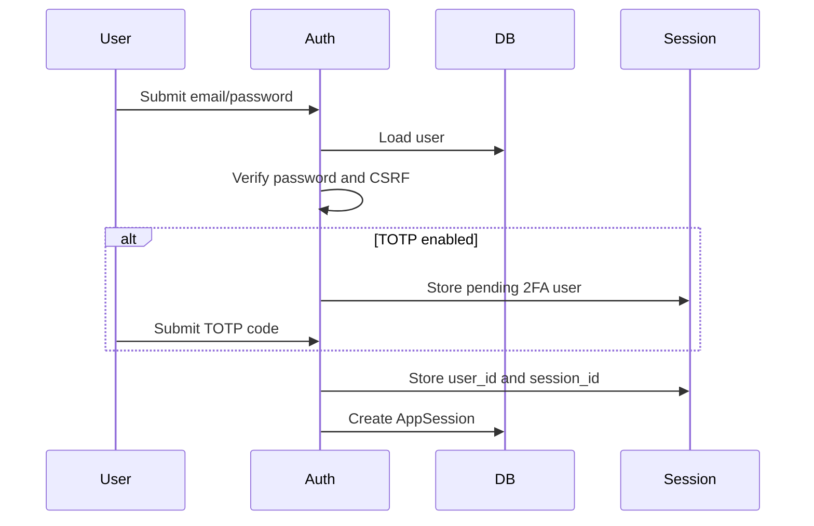

---
title: "Security"
description: "Current authentication, authorisation and security behaviour."
order: 6
version: "current"
---

This page describes Kaya's current security implementation.

## Authentication

Kaya uses email/password authentication with optional TOTP two-factor authentication.

Login flow:

1. If no users exist, `/login` redirects to `/setup`.
2. `/setup` creates the initial admin user.
3. `/login` validates CSRF, rate limits attempts, verifies the password hash and checks whether TOTP is enabled.
4. If TOTP is enabled, a pending 2FA session state is set before final login.
5. On successful login, `user_id` and a generated `session_id` are stored in the signed session cookie.
6. An `AppSession` row is created for audit/activity tracking.

## Session management

Session handling uses Starlette `SessionMiddleware`, so session data is stored client-side in a signed cookie.

The `AppSession` table is an activity ledger, not the source of session validity.

Session cookies use `same_site=strict`. The secure flag can be configured and is reinforced for HTTPS requests.

## Password handling

- Passwords are hashed with Argon2.
- Initial setup and user creation require passwords of at least 12 characters.
- Password reset tokens are stored as SHA-256 hashes.
- Password reset links expire after one hour.
- Login and password reset flows have in-memory rate limiting.

## Encryption

Fernet encryption protects stored secrets such as:

- Licence keys
- SMTP passwords
- DNS provider secrets
- Backup passwords
- API tokens
- TOTP secrets

Losing `ENCRYPTION_KEY` breaks decryption of stored secrets.

## File uploads

Hardware photos have stronger validation than general attachments. Other attachments are less strict.

Remote recordings are stored under `/app/data/remote-recordings` and may contain sensitive information.

There is no antivirus/content scanning in the current implementation.

## Demo mode restrictions

Demo mode:

- Creates synthetic admin/editor/viewer accounts.
- Can reset the demo database on a schedule.
- Blocks remote access paths, backup agent APIs and many mutating admin/network/security routes.
- Invalidates demo sessions when the demo generation marker changes.

Any new route that mutates data, reaches into the network, performs remote access or exposes secrets must be reviewed against demo-mode restrictions.

## Role-based access control

Roles:

- Admin: full administrative access, settings, users, audit logs and sensitive remote recordings
- Editor: can create and modify operational records
- Viewer: read-only access to most authenticated pages

Authorisation is implemented with FastAPI dependencies:

- `require_user`
- `require_editor`
- `require_admin`

## Production considerations

Current risks:

- Rate limits are in-memory and not distributed.
- RBAC is coarse-grained.
- Permissions are manually applied per route.
- No object-level access control.
- No malware scanning.
- Licence exports can expose decrypted product keys.
- Agents receive decrypted backup credentials and backup keys when jobs are dispatched.
- Multi-replica deployments could duplicate background polling.
